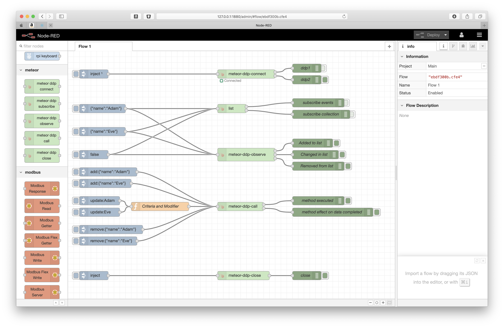

# NODE-RED DDP

A suite of Node-Red nodes for communicate with MeteorJS DDP servers.

MeteorJS is a great Javascript framework, it's reactivity model is very interesting for IoT applications, but it can't run on edge devices like Raspberry PI with  no tricky compilations.

Furthermore NODE-RED runs on Raspberry PI very well, and can be used not only on these devices but in the cloud too or on desktop PC. So if you want to connect a NODE-RED flow to a MeteorJS application re-using your API with Publish and Methods you are in the right place.

This work is a NODE-RED full implmementation of the [DDP NodeJS package](https://github.com/oortcloud/node-ddp-client#readme).

You can connect to one ore more MeteorJS applications, subscribe to the Meteor.publish and call the Meteor.methods from your NODE-RED flow.

Using the ```SESSION``` parameter in every node you can attach any subscribe, observe and call node to the right MeteorJS connection.

MeteorJS connections are stored in the NODE-RED global context so you can attach to the same MeteorJS connection from different NODE-RED flows.

## Installing the NODE-RED nodes

This is a standard NODE-RED contribution, the name is: ```node-red-contrib-meteor-ddp```.


## Example flow

This picture shows how the [example flow](NodeRedExampleFlow/flow.json) should appear on your NODE-RED interface.



## Example Meteor application

1. download if needed [MeteorJS](https://www.meteor.com/)
2. enter a desired directory
3. create a Meteor Application with the command ```meteor create myexample``` and enter the directory with ```cd myexample```
4. edit the file in myexample/server/main.js to obtain something like that

```
import { Meteor } from 'meteor/meteor';

var list = new Mongo.Collection("list") ;

Meteor.publish("list",function(params){
	console.log("Params",params) ;
	return list.find(params) ;
})

Meteor.methods({"add":function(params){
	return list.insert(params) ;
}});

Meteor.methods({"update":function(params){
	return list.update(params.criteria,params.modifier,{multi:true}) ;
}});

Meteor.methods({"remove":function(params){
	return list.remove(params) ;
}});

Meteor.startup(() => {
	// code to run on server at startup
	list.insert({
		name:'Ciao',
		addedOn: new Date() 
	})
});

```

5. now you can run the Meteor application with command ```meteor``` and test the example flow clicking on the left-side ijections nodes.

## How to use example flow


